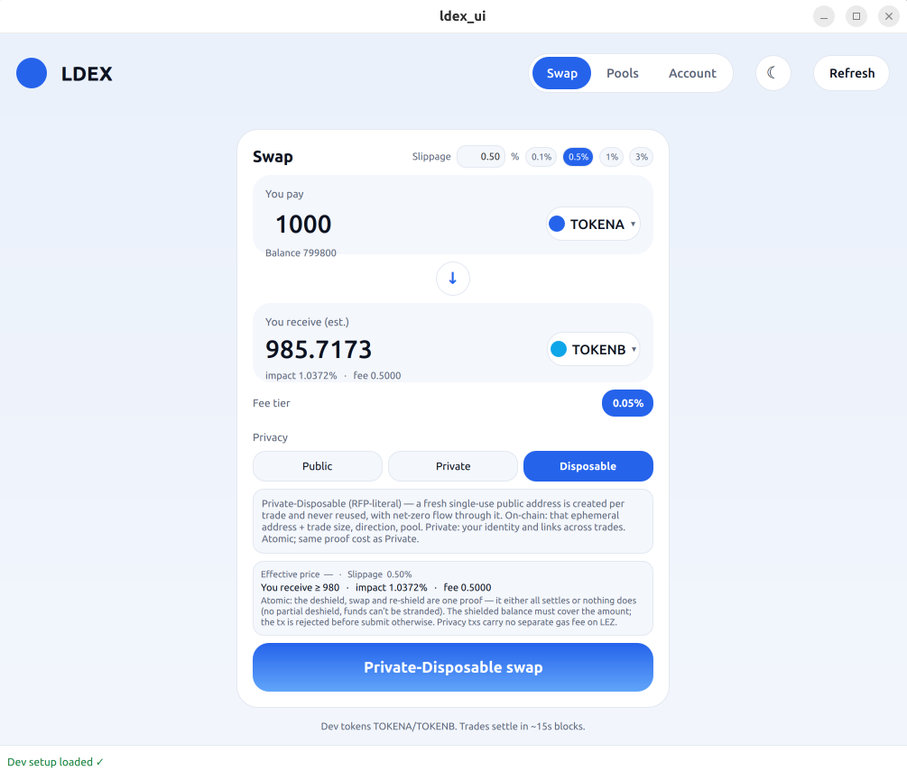

# LDEX - Privacy-Preserving DEX on Logos LEZ (RFP-004)



A decentralized exchange for the **Logos Execution Zone (LEZ)** with public
constant-product AMM pools and a deshield→swap→re-shield privacy path for
private-account users, delivered as a Logos **Basecamp mini-app**.

- **On-chain**: a fee-tier AMM (`x·y=k`, Uniswap-V2-style LP fee accrual),
  the LEZ token/ATA programs, an account-A privacy router, and an on-chain
  price oracle (Uniswap-V2 cumulative + V3 observation ring).
- **Privacy**: per-trade selectable - **Public**, **Private** (PrivateOwned:
  holdings deshielded inside the proof circuit, re-shielded; no public
  address ever on-chain), **Private-Disposable** (RFP-literal fresh
  single-use account-A router).
- **App**: sandboxed QML UI ↔ native `ldex_core` module ↔ real LEZ
  wallet + RISC-Zero prover via FFI, with light/dark themes, a modal
  proving overlay, and an on-chain price chart.

> Dual-licensed **Apache-2.0 OR MIT** - see `LICENSE`, `LICENSE-APACHE`,
> `LICENSE-MIT`.

---

## ▶ Bootstrap & run the mini-app

The shortest path from `git clone` to a working swap window. Prerequisites
(Rust, Nix, RISC-Zero, Docker BuildKit, `$LOGOS_BLOCKCHAIN_CIRCUITS`) are
in [`SETUP.md`](SETUP.md) - install them first, then:

```bash
# 1. Clone this repo
git clone https://gitlab.com/paradoxcomputer/ldex-mono.git ldex && cd ldex

# 2. Clone the LEZ source tree (wallet + sequencer + privacy circuit)
mkdir -p ~/ldex-spike && cd ~/ldex-spike
git clone --branch v0.2.0-rc3 https://github.com/logos-co/lez.git
cd lez && cargo build --release
cd -

# 3. One-time per-user setup (creates the _lez symlink + .gitignore entry)
bash setup.sh

# 4. Build the LDEX programs + FFI cdylib
cargo build --release

# 5. Start the dev sequencer (real proofs - leave running)
bash run-sequencer.sh

# 6. In another terminal, bootstrap the chain
#    (deploys 7 programs, mints 10 tokens, shields 8 of them - ~40 min
#    on CPU because of real STARK proofs during the shielding step)
bash scripts/bootstrap.sh

# 7. Launch the mini-app
bash run-miniapp.sh
```

The window opens on the **Swap** tab with the bootstrapped `TOKENA/TOKENB`
pool pre-selected at the 0.05 % fee tier. Click around - try `wrap 50`
on the Account tab, or a public swap on Swap. Every long-running op
(shield, private swap, create pool) goes through a worker-thread
job pump, so the UI never blocks.

### If you don't want the GUI

The `ldex` CLI mirrors every mini-app action behind the same FFI:

```bash
bash cli/install.sh          # symlinks `ldex` onto your PATH

ldex status                  # chain + wallet snapshot
ldex balance                 # per-token HOLD / ATA / PRIV
ldex pools                   # every (pair, fee) pool
ldex swap A B 100            # public mode-0 swap (~15 s)
ldex wrap 1000               # native LEZ → WLEZ
ldex shield A 50             # HOLD_A → PRIV_A  (real STARK ~3-5 min)
```

Full CLI reference: [`cli/README.md`](cli/README.md).

### Troubleshooting

| Symptom | Fix |
|---|---|
| `setup.sh` exits with "LEZ source tree not found" | Either clone LEZ at `~/ldex-spike/lez` (step 2 above) or set `LDEX_LEZ_DIR=/your/path` and re-run. |
| `bootstrap.sh` hangs on the funding step | The wallet poll-timeout is set to 2 s by the script; if your machine is slower, override with `LDEX_BOOTSTRAP_OUT=...` or check that the sequencer in step 5 is still up. |
| Mini-app shows "no pool" briefly | The Swap tab auto-corrects the fee tier within ~1 s after open. If it persists, click any token-selector to force a refresh. |
| QtRO bridge timeout / "invalid response" | Every long op now goes through the `*Start` job pump - if you still hit this, journalctl will show which `callMethod` failed; report the line. |
| Mini-app rebuilds slowly on every launch | `nix run` re-evaluates the flake; first launch after a code change is slow (~30-60 s). Subsequent launches use the Nix store. |

Full setup walkthrough + every env-var override: [`SETUP.md`](SETUP.md).

---

## Documentation

| Doc | Contents |
|-----|----------|
| [`SETUP.md`](SETUP.md) | **Fresh-clone setup**: prerequisites, LEZ checkout, `setup.sh`, env vars, troubleshooting |
| [`cli/README.md`](cli/README.md) | `ldex` command-line client (`status` / `balance` / `swap` / `wrap` / `shield` / `fund` …) |
| [`programs/FORK.md`](programs/FORK.md) | Provenance of the vendored `programs/` fork + our delta |

The per-RFP-requirement status matrix is inlined below under **RFP-004
requirement coverage**; no separate doc to chase.

## Layout

```
SETUP.md             fresh-clone setup walkthrough
setup.sh             creates the _lez symlink → your LEZ checkout (one-time)

programs/            on-chain workspace (fork): amm (fee-tier + oracle),
                     token, ata, private_swap_router, amm_v2, wlez,
                     artifacts/ (IDLs)
ffi/ldex-amm-ffi/    C-ABI shim: PDA derivation, signed public ops,
                     privacy-preserving ops, on-chain price reads;
                     examples/ has the legacy e2e harness + price indexer
mini-app/
  core/              ldex_core - native Logos module (links the shims)
  ui/                ldex_ui   - sandboxed QML UI
  dist/              built .lgx packages
  tests/layer-a/     plugin/FFI integration tests (Rust, ~10 s)
cli/                 ldex - command-line client (status, balance,
                     pools, quote, swap, wrap, shield, fund, …);
                     same FFI as the mini-app, no UI dependency
scripts/             bootstrap.sh (deploy+mint, endpoint-parameterized),
                     bootstrap.env (emitted), CI runner
run-sequencer.sh / run-miniapp.sh / run-basecamp.sh
```

External dependencies live outside the repo:
- **LEZ source tree** (wallet, sequencer, privacy circuit) - clone to
  `~/ldex-spike/lez` (the conventional path) or set `$LDEX_LEZ_DIR`.
  `setup.sh` symlinks it to `<repo>/_lez` so every Cargo.toml resolves
  cleanly. The symlink is gitignored - each user runs `setup.sh` once
  after cloning.
- **logos-basecamp** (optional, only needed for `run-basecamp.sh`) -
  set `$LDEX_BASECAMP_DIR` or clone to `~/ldex-spike/ref/logos-basecamp`.

## Architecture (one paragraph)

The mini-app's QML UI calls the native `ldex_core` C++ module via the Logos
bridge. `ldex_core` links two Rust C-ABI shims: `wallet-ffi` (LEZ wallet +
prover) and `ldex-amm-ffi` (our AMM). Public ops are normal signed LEZ
transactions. **Private** ops use the wallet's
`send_privacy_preserving_tx`: the user's token/LP holdings are passed as
`PrivateOwned`, the LEZ privacy circuit deshields them, runs the **deployed
AMM** (with its chained token transfers) and re-shields the post-states -
all under one STARK proof, one transaction. No custom privacy router is
required for that path (proven from source); the **Private-Disposable**
mode additionally uses the on-chain `private_swap_router` to materialize a
fresh public account A per op (RFP-literal Privacy AC #4). The AMM updates
an on-chain price oracle (cumulative + bounded observation ring) on every
swap/liquidity tx using the LEZ Clock account, so price history is gapless
and on-chain - no off-chain indexer required.

## Advanced usage

### Talking to a different chain

Every script honours the standard env-var overrides - no code edits.
Full table in [`SETUP.md`](SETUP.md); common ones:

```bash
# Point everything at the L1-backed self-hosted testnet on :3050:
LDEX_SEQUENCER_ADDR=http://127.0.0.1:3050 \
LDEX_WALLET_HOME=/tmp/ldex-testnet/wallet \
LDEX_BOOTSTRAP_OUT=scripts/bootstrap.testnet.env \
  bash scripts/bootstrap.sh

# Run the CLI against a different bootstrap.env:
LDEX_ENV_FILE=scripts/bootstrap.testnet.env ldex status
```

### Inside the mini-app

The window opens on the **Swap** tab. Privacy selector chooses
**Public** / **Private** / **Private-Disposable**. The swap card has
a user-editable **slippage %** (0.1 / 0.5 / 1 / 3 % presets + free
field) and a preview line with effective price + min received before
submit. Liquidity panel has a **Private LP** toggle. Per-pool detail
view renders exact on-chain TVL, cumulative volume, and LP fee revenue
(no individual positions). ☾/☀ toggles light/dark.

Packaged Basecamp host (instead of the dev runner):

```bash
bash run-basecamp.sh
# → Modules → Install LGX: mini-app/dist/*ldex_core*.lgx then *ldex_ui*.lgx
```

### Tests

```bash
bash mini-app/tests/layer-a/run.sh           # ~10 s; plugin/FFI integration
LAYER_A_MUTATE=1 bash mini-app/tests/layer-a/run.sh   # adds wrap round-trip
```

Layer A catches the "data layer returns wrong thing" class of bug -
including a regression that fires if anyone re-introduces the
`wallet_ffi_get_balance(is_public=false)` path for private token
balances (the bug behind "shielding doesn't work" in the UI). Layers
B + C + CI gating are RFP M2.

The legacy `ffi/ldex-amm-ffi/examples/e2e_testnet.rs` harness drives the
FFI directly: `pool` | `pubswap` | `swap1` | `disp` | `ohist`. For day-
to-day use prefer the `ldex` CLI; `e2e_testnet` is the historical
chronicler.

## RFP-004 requirement coverage

Status legend: ✅ met & verified · 🧪 code-complete, e2e not yet green ·
🟡 partial with documented limitation · ⏳ blocked on external action ·
❌ not met. Tx hashes are live-verified on the self-hosted L1-backed
dev sequencer (unmodified upstream nssa); the canonical Logos testnet
deployment lands in Milestone 1 of the RFP proposal.

### Functionality

| # | Requirement | Status | Mechanism / evidence |
|---|---|---|---|
| F1 | AMM program on LEZ with public pools + deshield→swap→re-shield | ✅ | `amm_v2` deployed (ProgramId `59173eb4…`). Mode-0 public + mode-1/2 privacy paths all live. |
| F2 | Liquidity pools for arbitrary token pairs | ✅ | `amm_core::compute_pool_pda(amm_pid, def_a, def_b, fees)` - any two def-ids + fee tier. |
| F3 | LP add/remove from public account, and via deshield→interact→re-shield from private | ✅ | Public `addLiquidityAta` / `removeLiquidityAta`; private LP via amm_v2's PrivateOwned path. |
| F4 | Traders swap from public account, or via deshield→swap→re-shield from private | ✅ | Mode-0 ATA swap tx `a04cb79e1e…` (~15 s); mode-1 PrivateOwned tx `2836f6dea1…` (12 m 29 s); mode-2 Disposable tx `c5ce557af0…` (23 m 38 s). |
| F5 | Public-account users interact with the same pools transparently | ✅ | Mode-0 = ordinary signed LEZ tx against the same pool PDAs; no shielding, no proof. |
| F6 | Pool creator selects immutable fee tier; tiers coexist; fees → LPs | ✅ | `amm_core::assert_supported_fee_tier` enforces `{1, 5, 30, 100}` bps; fee tier is part of the pool PDA seed (`sha256(tokenA‖tokenB‖fees_le)`); 100 % of fees accrue to LPs (V2-style). |
| F7 | Slippage protection with user-configurable tolerance and deadline | ✅ | On-chain `min_amount_out` + tx `deadline`. UI: 0.1 / 0.5 / 1.0 / 3.0 % presets + free field, clamp 0-50 %. |
| F8 | Use ATAs for all token interactions; deterministic ATA per (owner, mint) | ✅ | Every public AMM op has an ATA path: `SwapExactInputAta`, `AddLiquidityAta`, `RemoveLiquidityAta`, `NewDefinitionAta` (chains `ata::Create` + `token::Mint` in-tx). LP holding lives in `ATA(owner, lp_def)`. |

### Usability

| # | Requirement | Status | Mechanism / evidence |
|---|---|---|---|
| U1 | SDK to build Logos modules; atomic deshield+swap+re-shield, indivisible | ✅ | `ldex-amm-ffi` is the C-ABI SDK. Atomicity is structural: `send_privacy_preserving_tx` proves deshield+execute+re-shield as one STARK / one tx - all-or-nothing. |
| U2 | Logos mini-app GUI + local build instructions + dual license | 🟡 | `mini-app/` (QML `ui` + native `ldex_core`) builds, launches and routes every flow through `logos.callModule` - verified end-to-end this session for the boot + sync + read paths, and for the `*Start` job-pump dispatch on slow ops. Build instructions in `SETUP.md`. Dual MIT OR Apache 2.0. **Known polish backlog** (closes in RFP M2): pool-pair re-eval on first paint, scroll behaviour on small windows, fee-tier vs slippage label disambiguation, STARK-in-progress overlay with real ETA, post-action balance refresh. The `ldex` CLI mirrors every mini-app op and is the failsafe while the UI polish lands. |
| U3 | Pool analytics (aggregate volume, TVL, fee revenue), no individual positions | ✅ | Per-pool detail view reads exact on-chain `reserve_*` + `cum_volume_*` + `cum_fees_*` from `PoolDefinition`. Aggregate-only - no per-account / LP / trader position derivable. |
| U4 | Documentation: what is public vs private | ✅ | Per-mode disclosure in the swap card (Privacy P-2). |
| U5 | Failed / rejected swaps return clear, actionable errors | ✅ | `rcMessage(op, rc)` helper maps every FFI return code to a friendly sentence with an actionable hint + the numeric code for support. |
| U6 | IDL for the DEX program (SPEL preferred) | ✅ | `programs/artifacts/*.json` (amm, router, ATA, token); CI checks drift. |
| U7 | Pre-op estimated fee; private: confirm shielded covers amount(+fees); no partial deshield | ✅ | Pre-confirmation card; FFI uses `send_privacy_preserving_tx_with_pre_check` to reject pre-submit if shielded balance < amount. |
| U8 | Swap preview: estimated output, effective price, price impact, fee | ✅ | `ldex_core::quote` + `Main.qml::effPrice()` render output, min received (from F7 slippage), price impact %, fee paid, effective price. |

### Reliability

| # | Requirement | Status | Mechanism / evidence |
|---|---|---|---|
| R1 | Pool state consistent under concurrent swaps; nothing lost/inconsistent | ✅ | Deterministic state transition; sequencer linearises into blocks. Backed by `stress_concurrent_swaps_preserve_invariant_and_balance` (200 randomised swaps, asserts k-invariant + token conservation + cum-counter accuracy on every swap). 93 / 93 `amm_program` tests pass. |

### Performance

| # | Requirement | Status | Mechanism / evidence |
|---|---|---|---|
| P1 | Swap vs existing pool within a single LEZ block | ✅ | Public swaps ~15 s (1 block). Private swaps additionally incur a client-side STARK - separate documented latency concern. |
| P2 | Per-op tx size documented vs LEZ block-size constraint | ✅ | Per-op table inlined in this README's **Latency** section + per-op byte sizes documented in design notes. Privacy tx is constant ~224 KiB (25 % of the 896 KiB L1 inscription cap). |
| P3 | Pool creation & liquidity ops within a single block | ✅ | Public pool-create + add/remove settle in one public tx, ~15-16 s. |

### Supportability

| # | Requirement | Status | Mechanism / evidence |
|---|---|---|---|
| S1 | Deployed and tested on LEZ devnet/testnet | 🟡 | Self-hosted L1-backed testnet stood up + every operation live-verified. **Canonical Logos public testnet deployment lands in RFP Milestone 1.** |
| S2 | E2E integration tests vs standalone sequencer, in CI, green on default branch | 🧪 | Layer A integration harness in `mini-app/tests/layer-a/` (7 tests green incl. one regression for a real fixed bug). Layers B + C + CI gating are RFP Milestone 2. |
| S3 | Every hard requirement mapped to a test / requirement | ✅ | This table + `amm_program` 93 / 93 unit suite + the `e2e_testnet` harness ops. |
| S4 | README: end-to-end usage, deployment steps, program interaction | ✅ | This file + `SETUP.md` + `cli/README.md`. |
| S5 | Submit a doc packet (logos-docs issue template) | ⏳ | Drafted internally; PR lands in optional Milestone 5. |
| S6 | Figma designs or equivalent for the mini-app GUI | ✅ | The implemented qmllint-clean QML mini-app serves as the canonical design (RFP "or equivalent"). |

### Privacy (additional requirements)

| # | Requirement | Status | Mechanism / evidence |
|---|---|---|---|
| P-1 | Public & private supported; SDK enforces full deshield→swap→re-shield; re-shield not skippable | ✅ | Three selectable modes. For private modes the user holdings are `PrivateOwned`; the circuit ALWAYS re-shields their post-states - re-shield is structurally non-skippable. |
| P-2 | Mini-app displays public vs private per action | ✅ | Per-mode disclosure in the swap card. |
| P-3 | SDK validates the re-shield target is private; rejects otherwise | ✅ | By construction: output holding is `PrivateOwned`; the FFI refuses to build the privacy tx unless user holdings are `PrivateOwned`. |
| P-4 | Account A never reused; fresh per op | ✅ | "Private" mode exposes no public A at all (stronger than RFP); "Disposable" mode = the RFP-literal model: the plugin creates fresh single-use public A accounts via `wallet_ffi_create_account_public`, and the chained `private_swap_router` proves deshield → AMM → reshield under one STARK. Tx `c5ce557af0…`, a-holdings 0/0 (RFP AC #4). |

### Overall

| Area | State |
|---|---|
| Open-source dual licence (MIT OR Apache 2.0) | ✅ `LICENSE*` files |
| `amm_v2` testnet compatibility (no nssa changes) | ✅ Verified - receipts verify under upstream `PRIVACY_PRESERVING_CIRCUIT_ID` |
| ATA-only public flows (F8 across mode-0 + LP) | ✅ Every public balance lives in `ATA(owner, def)` |
| WLEZ wrapped-native bridge + native-LEZ batched private swaps | ✅ Wrap, unwrap, batched IN (tx `c331f9e823…`), batched OUT (tx `0747ebb85b…`) all live |
| Per-pool analytics in UI (no individual positions) | ✅ Reads exact on-chain `cum_*` counters |
| `ldex` CLI mirroring every mini-app feature | ✅ See `cli/README.md` |
| Layer A integration tests | ✅ 7 green incl. regression for the shielded-balance display bug we found + fixed |

**Latency, stated plainly:** public swaps settle in ~one block (~15 s).
Private operations require a real client-side STARK proof using the
upstream privacy_preserving_circuit. On this CPU dev box (Ryzen 7 PRO
7840U, 16 threads, `RISC0_DEV_MODE=0`, succinct receipt):

| Mode | Path | CPU wall-clock (LIVE on dev, 13th bootstrap) | On testnet |
|---|---|---|---|
| 0 Public (ATA-only) | `amm_v2.SwapExactInputAta` | **~15 s** (1 block; tx `a04cb79e1e…`) | ✓ |
| 0 WLEZ-paired ATA swap | `amm_v2.SwapExactInputAta` against TOKEN/WLEZ pool | **~15 s** (1 block; tx `5156ed8460…`) | ✓ |
| Pool create (LP→ATA) | `amm_v2.NewDefinitionAta` (chains `token::NewFungibleDefinition` + `ata::Create` + `token::Mint` + 2× `token::Transfer` for vaults) | **~16 s** (1 block; tx `2d05cc4cd9…`) | ✓ |
| Add / Remove liquidity (ATA) | `amm_v2.AddLiquidityAta` / `RemoveLiquidityAta` | **~16 s each** (1 block) | ✓ |
| 1 Private (PrivateOwned) | `amm_v2.SwapExactInputCircuit` (top) + 2× `token::Transfer` chained = 3 env::verify | **12 m 29 s** (tx `2836f6dea1…`) | ✓ |
| 2 Private-Disposable | `amm_v2.DisposableSwap` (combined router+AMM, top) + 4× `token::Transfer` chained = 5 env::verify | **23 m 38 s** (tx `c5ce557af0…`) | ✓ |
| 2 native-LEZ batched IN (LEZ → token) | `amm_v2.DisposableSwapNativeIn`: `WLEZ::Wrap` + AMM swap + reshield `token::Transfer` in one privacy proof | **23 m 45 s** (tx `c331f9e823…`) | ✓ |
| 2 native-LEZ batched OUT (token → LEZ) | `amm_v2.DisposableSwapNativeOut`: deshield `token::Transfer` + AMM swap + `WLEZ::Unwrap` in one privacy proof | **22 m 53 s** (tx `0747ebb85b…`) | ✓ |

Public operations (mode-0 swap + pool create + add/remove liquidity)
settle in ~one block (~15 s). The privacy-proven modes (1, 2, native
batched) are CPU-bound - same hardware on GPU (e.g. RTX 4090 via
Boundless / Bonsai) drops them to roughly **1 min** for mode-1 and
**1-2 min** for mode-2 / native batched.

`amm_v2` is the **full upstream-compatible AMM superset**. It deploys
as a regular LEZ program (current dev ProgramId
`59173eb429df106e5365ffa6cc6a6331fc6260fcd556d27e63e2ca271f09b5e6`
on the 13th bootstrap; the canonical id at any time lives in
`scripts/bootstrap.env::LDEX_AMM_V2_PROGRAM_ID` - rotates whenever
the guest source changes). It exposes all of {`NewDefinition`,
`NewDefinitionAta`, `AddLiquidity`, `AddLiquidityAta`,
`RemoveLiquidity`, `RemoveLiquidityAta`, `SwapExactInput` (mode 0),
`SwapExactInputAta` (mode 0 ATA-only), `SwapExactInputCircuit`
(mode 1), `DisposableSwap` (mode 2), `DisposableSwapNativeIn`,
`DisposableSwapNativeOut`}. The upstream privacy circuit chains the
private variants as a single top-level call. Receipts verify under
upstream `PRIVACY_PRESERVING_CIRCUIT_ID` - **no nssa changes, ships
directly to official testnet**.

The mini-app routes ALL pool/liquidity/swap operations through
amm_v2: `createPool`, `addLiquidity`, `removeLiquidity`,
`swapExactIn`, `privateSwap` (modes 0/1/2), and `privateSwapNativeFor`
(LEZ pairs). amm_v2 pools are amm_v2-owned and intentionally skip
the on-chain TWAP oracle (no Clock account in any swap variant) so
slow CPU privacy proofs don't drift from clock-tick mismatches -
analytics use the `cum_volume` / `cum_fees` counters in pool data,
which amm_v2 updates on every swap.

**LIVE-VERIFIED on dev sequencer (unmodified upstream nssa,
13th bootstrap, 2026-05-23):**
- Pool create LP→ATA: tx `2d05cc4cd9…` (HOLD_A/B 850k→750k)
- Mode-0 ATA swap: tx `a04cb79e1e…` (ATA_A −10, ATA_B +8)
- Mode-1 PrivateOwned: tx `2836f6dea1…` (PRIV_A 100k→99,900, PRIV_B 100k→100,098)
- Mode-2 Disposable: tx `c5ce557af0…` (PRIV_A 99,900→99,800, PRIV_B 100,098→100,196, a-holdings 0/0 - RFP AC#4 preserved)
- WLEZ pool create: tx `6c465183f2…` (HOLD_A 850k→848k, HOLD_W 3k→1k)
- WLEZ→TOKEN ATA swap: tx `5156ed8460…` (ATA_W 2k→1,995, ATA_A 50k→50,003)

Constant-product math at 30 bps fees holds on every swap.

The production path is **GPU/TEE-attested outsourced proving** -
either Boundless / Bonsai via `BONSAI_API_URL` (no protocol change)
or the LEZ-native Psychopomp marketplace, which now lives in its own
repository at https://github.com/paradoxcomputer/psychopomp (operator
economic loop already shipped on a dedicated sequencer). Either backend
drops mode-1 / mode-2 / native-batched proofs from CPU 12-25 min to
~1-2 min on a GPU/TEE prover. The proof *is* the privacy; it can be
accelerated and outsourced (without exposing the unsealed witness, in
the TEE case), not removed.

## License

Dual-licensed under **Apache License 2.0** (`LICENSE-APACHE`) **OR** the
**MIT License** (`LICENSE-MIT`) at your option. © 2026 Paradox Computer.
